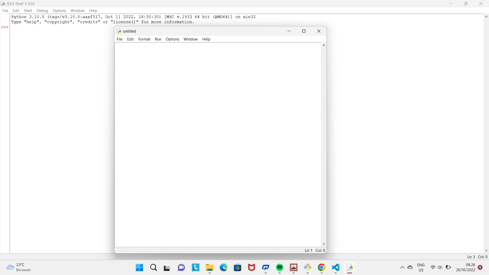

#lab2py
# Untuk menjalankan program python pertama tama adalah buka web resmi python dan download program python tersebut

# Setelah mendownload dan menginstal python kita buka python tersebut dengan Windows+R

# Jalankan program dengan mengetik py terlebih dahulu

# Jalankan program latihan pertama

# Jalnakan program latihan kedua 

# Untuk menjalankan progran latihan ketiga kita cari IDLE tersebut di pencarian dan ketikan IDLE

# Setelah itu akan muncul halaman seperti di bawah ini

# Untuk menjalankan program latihan ketiga tekan Ctrl+N dan akan muncul halaman seperti di bawah ini

# Jalankan program latihan ketiga

# Dan semua program sudah selesai di kerjakan, setelah itu lakukan git push
